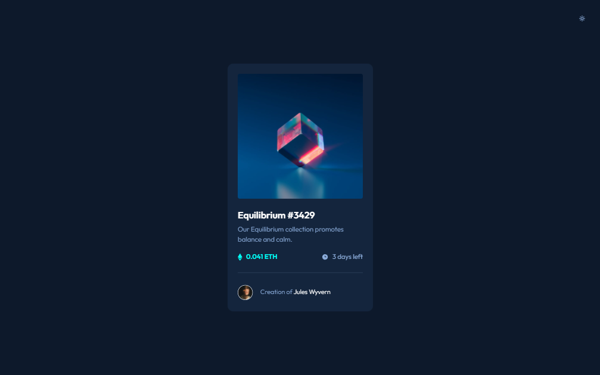

# Frontend Mentor - NFT preview card component solution

This is a solution to the [NFT preview card component challenge on Frontend Mentor](https://www.frontendmentor.io/challenges/nft-preview-card-component-SbdUL_w0U). Frontend Mentor challenges help you improve your coding skills by building realistic projects.

## Table of contents

- [Overview](#overview)
  - [The challenge](#the-challenge)
  - [Screenshot](#screenshot)
- [My process](#my-process)
  - [Built with](#built-with)
  - [Continued Development](#continued-development)

## Overview

### The challenge

Users should be able to:

- View the optimal layout depending on their device's screen size
- See hover states for interactive elements

### Screenshot

\
\

### Links

- Solution URL: [Github Repo](https://github.com/bague-rodnel/nft-preview-card-component)
- Live Site URL: [Github Pages](https://bague-rodnel.github.io/nft-preview-card-component/)

## My process

### Built with

- Semantic HTML5 markup
- CSS / Bootstrap
- Mobile-first workflow

This is a very tiny project to use bootstrap for. Since the task is very simple, I toyed with light/dark theme switching.

### Continued Development

This is a good snippet that may fit well in a larger project. I may revisit this to re assess if my choice of colors for the theme switch are optimal.
